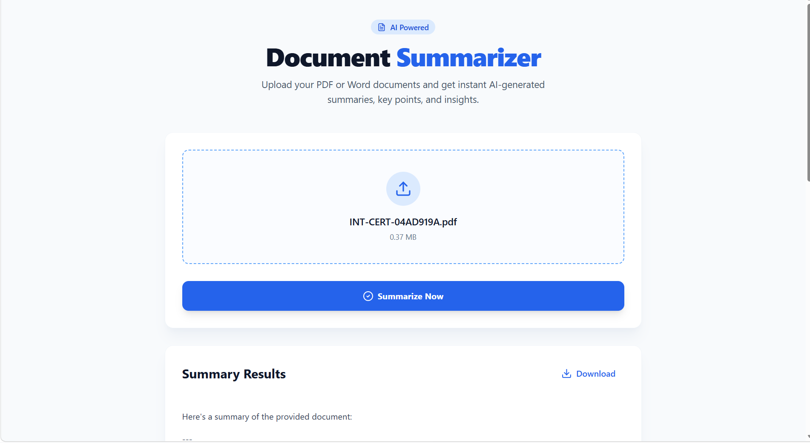
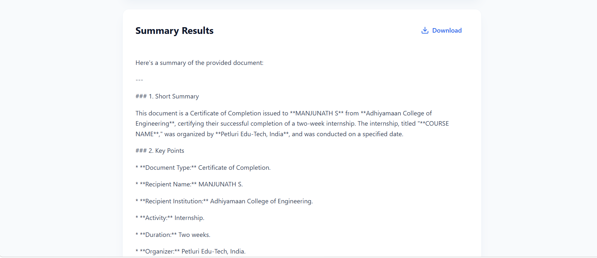
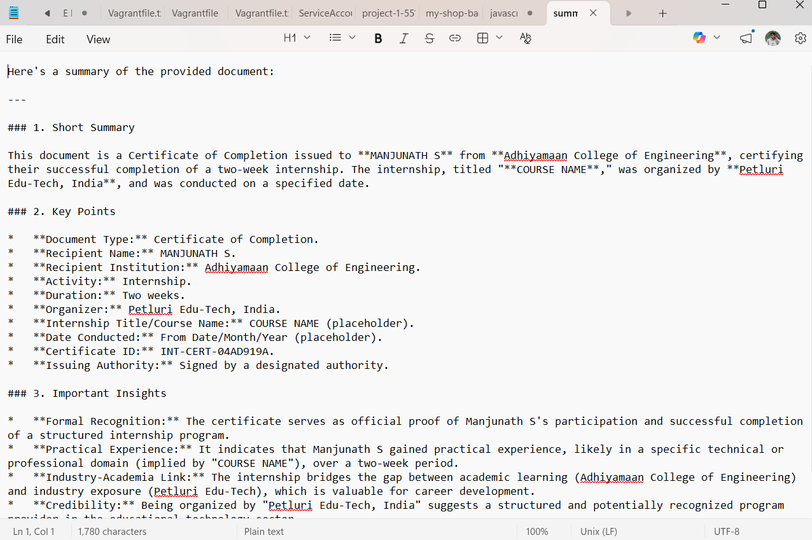

# AI Document Summarizer 🚀

A modern, clean web application that uses Google Gemini AI to summarize PDF and DOCX documents. 


## ✨ Features

- 📑 **PDF & DOCX Support**: Easily upload and process common document formats.
- 🤖 **AI-Powered Summaries**: Leveraging Google's Gemini-2.5-Flash for high-quality insights.
- 🎯 **Key Point Extraction**: Get instant summaries, key points, and important insights.
- 📥 **Download Summaries**: Save your AI-generated summaries as text files.
- 🎨 **Responsive UI**: A beautiful, minimal interface built with Tailwind CSS and Framer Motion.

## 📸 Screenshots

| Upload Document | AI Processing | Summary Results |
| :---: | :---: | :---: |
|  |  |  |

## 🛠️ Tech Stack

### Frontend
- **React 19** (Functional Components, Hooks)
- **Tailwind CSS** (Styling)
- **Framer Motion** (Animations)
- **Lucide React** (Iconography)
- **Axios** (API Requests)

### Backend
- **Node.js** & **Express**
- **Google Generative AI SDK** (Gemini Integration)
- **Multer** (File Handling)
- **PDF-Parse** & **Mammoth** (Text Extraction)

---

## 🚀 Getting Started

### 1. Prerequisites
- Node.js (v18 or higher)
- Google Gemini API Key ([Get one here](https://aistudio.google.com/app/apikey))

### 2. Backend Setup
```bash
cd backend
npm install
```
Create a `.env` file in the `backend` directory:
```env
GEMINI_API_KEY=your_actual_api_key_here
PORT=5000
```
Run the backend:
```bash
npm run dev
```

### 3. Frontend Setup
```bash
cd frontend
npm install
npm run dev
```

The application will be running at `http://localhost:3000`.

---

## 📂 Project Structure

```text
ai-document-summarizer/
├── backend/            # Express server & AI integration
├── frontend/           # React client application
└── README.md           # Documentation
```

## 📝 License
This project is for educational purposes and is open-source.
